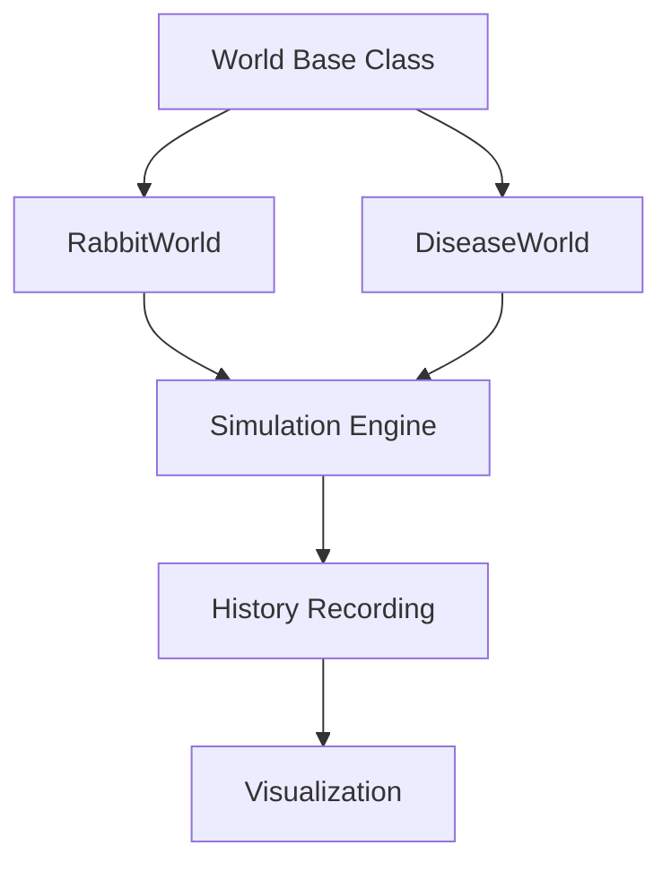

# Reality Engine

### A Modular Simulation Framework

Reality Engine is a modular simulation framework built in Python for modeling state-based systems that evolve over time.

The framework separates the simulation engine from the worlds it simulates, allowing multiple systems to share the same execution pipeline.

---

## Architecture



---

## Features

- Modular simulation engine with a shared `World` interface
- Object-oriented world abstraction (polymorphic `step()` method)
- Multiple interchangeable simulation worlds
- Automatic per-step history recording
- Generic time-series visualization, agnostic to world type
- Easily extendable architecture

---

## Project Structure

```text
reality-engine/
│
├── engine/
│   ├── world.py
│   ├── simulate.py
│   └── visualize.py
│
├── worlds/
│   ├── rabbit_world.py
│   └── disease_world.py
│
├── images/
│   ├── rabbit_world.png
│   └── disease_world.png
│
├── main.py
├── requirements.txt
└── README.md
```

---

## Implemented Worlds

### Rabbit Ecosystem

A resource-constrained population model where:

- Rabbits reproduce (birth rate scaled by grass availability)
- Rabbits die at a constant rate
- Rabbits consume grass
- Grass regrows over time, capped at its initial value

State variables: Population, Grass

**Results (100 steps):** Population peaked at 121.94 (step 2), then declined 93.6% to a minimum of 7.86 (step 40) as grass was depleted. As grass regenerated, population partially recovered before entering a second decline a boom-bust cycle driven purely by resource constraints, with no explicit predator.

---

### Disease Spread

A compartmental SIR (Susceptible-Infected-Recovered) epidemic model:

- Susceptible
- Infected
- Recovered

The disease evolves according to configurable spread and recovery rates.

**Results (20 steps):** With a spread rate of 0.4 and recovery rate of 0.2 (basic reproduction number R₀ = 2.0), infections peaked at 21.68 individuals at step 9, before declining as the susceptible population was depleted. By step 19: Susceptible ≈ 28.75, Recovered ≈ 74.40.

---

# Example Outputs

## Rabbit Ecosystem


---

## Disease Spread


---

## Running

```bash
python main.py
```

Both example simulations (Rabbit Ecosystem and Disease Spread) run by default. Comment out either block inside `main.py` to run a single simulation.

---

## Requirements

- Python 3.14
- matplotlib

Install dependencies:

```bash
pip install -r requirements.txt
```

---

## Future Extensions

The framework is designed to support additional worlds such as:

- Predator–Prey ecosystems
- Financial markets
- Cellular automata
- Resource allocation systems
- Custom user-defined simulations

---