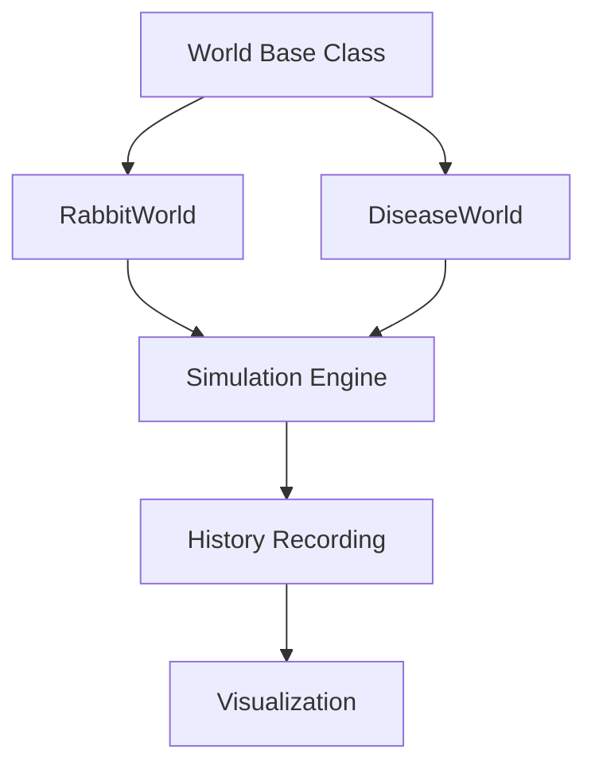
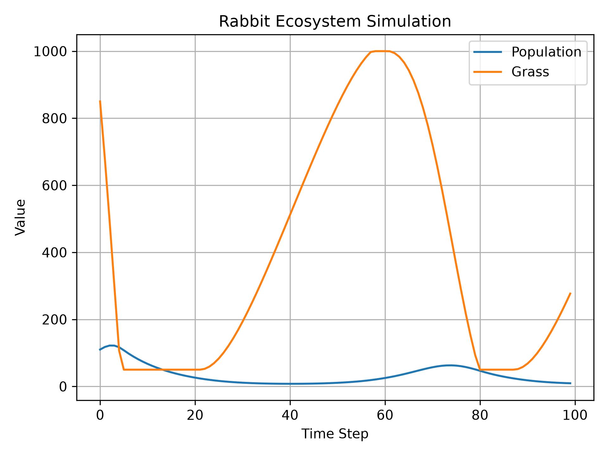
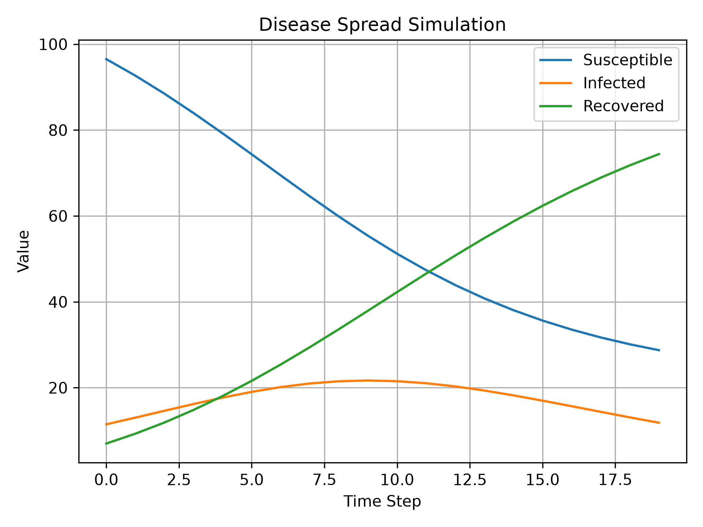

# Reality Engine

### A Modular Simulation Framework

Reality Engine is a modular simulation framework built in Python for modeling state-based systems that evolve over time.

The framework separates the simulation engine from the worlds it simulates, allowing multiple systems to share the same execution pipeline.

---

## Architecture



---

## Features

- Modular simulation engine
- Object-oriented world abstraction
- Multiple interchangeable simulation worlds
- Automatic history recording
- Generic time-series visualization
- Easily extendable architecture

---

## Project Structure

```text
reality-engine/
│
├── engine/
│   ├── world.py
│   ├── simulate.py
│   └── visualize.py
│
├── worlds/
│   ├── rabbit_world.py
│   └── disease_world.py
│
├── images/
│   ├── rabbit_world.png
│   └── disease_world.png
│
├── main.py
├── requirements.txt
└── README.md
```

---

## Implemented Worlds

### Rabbit Ecosystem

Simulates an ecosystem where:

- Rabbits reproduce
- Rabbits die naturally
- Rabbits consume grass
- Grass regrows over time

State variables:

- Population
- Grass

---

### Disease Spread

Simulates disease propagation through interacting populations:

- Susceptible
- Infected
- Recovered

The disease evolves according to configurable spread and recovery rates.

---

# Example Outputs

## Rabbit Ecosystem



---

## Disease Spread



---

## Running

```bash
python main.py
```

Choose the desired simulation by uncommenting the corresponding example inside `main.py`.

---

## Requirements

- Python 3.14
- matplotlib

Install dependencies:

```bash
pip install -r requirements.txt
```

---

## Future Extensions

The framework is designed to support additional worlds such as:

- Predator–Prey ecosystems
- Financial markets
- Cellular automata
- Resource allocation systems
- Custom user-defined simulations

---

## License

This project is provided for educational and experimentation purposes.